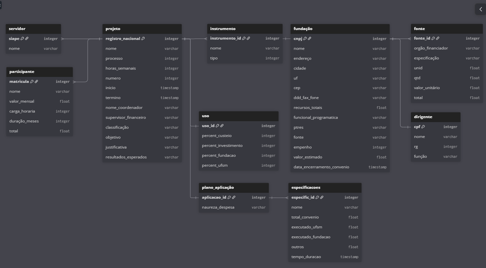

# Sobre o banco de dados

<a href="https://dbdiagram.io/d/COPROC-diagram-69fa492454a51d93d39b1370">Abrir link no DBdiagram</a> 
  

## 📌 Visão Geral

A modelagem foi construída com base nas informações que devem estar descritas nos documentos que devemos gerar.

- Projetos
- Servidores e Participantes
- Fundações e Fontes de recursos
- Instrumentos e uso de recursos
- Plano de aplicação e especificações financeiras

## 🧱 Entidades Principais

- 📁 Projeto : Tabela central do sistema. 
- 👤 Servidor : Representa servidores vinculados ao projeto.
- 👥 Participante : Representa bolsistas ou participantes do projeto.
- 🏛️ Fundação : Entidade responsável pela gestão financeira.
- 💰 Fonte : Representa as fontes de financiamento.
- 👔 Dirigente : Responsável vinculado à fundação.
- 🔧 Instrumento : Define o tipo de instrumento utilizado no projeto.
- 📊 Uso : Define a distribuição percentual dos recursos.
- 📦 Plano de Aplicação : Representa categorias de despesas.
- 📌 Especificações : Detalhamento financeiro de cada aplicação.

Relacionamento: Um **plano de aplicação** pode ter várias **especificações** (**1:N**)